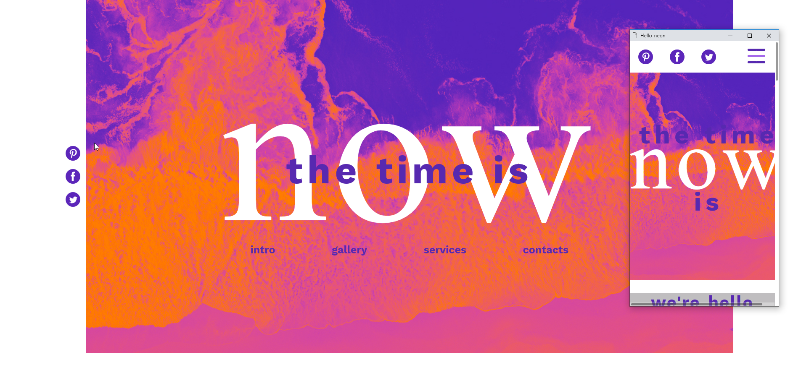

# HELLO NEON
An animated, fully responsive demo landing page of a creative-studio. 

## Table of contents
* [General info](#general-info)
* [Screenshots](#screenshots)
* [Technologies](#technologies)
* [Setup](#setup)
* [Features](#features)
* [Status](#status)
* [Inspiration](#inspiration)
* [Contact](#contact)

## General info
Page was written to practise keyframes, media queries, sass preprocessor and java script. All animations are my authorship.

## Screenshots

## Technologies
* HTML5
* SASS/CSS5
* Java Script
* Written in Visual Studio Code

## Setup
Link to demo version;
https://egwizdala.github.io/HELLO_NEON/

## Features
* animated hamburger menu
* animated hero img
* all mobile devices responsive

## Status
Project is: _finished_

## Inspiration
Layout made by the https://theawwwesomes.org.

## Contact
Created by Emilia Gwizdala emilia.gwizdala@gmail.com - feel free to contact me!
